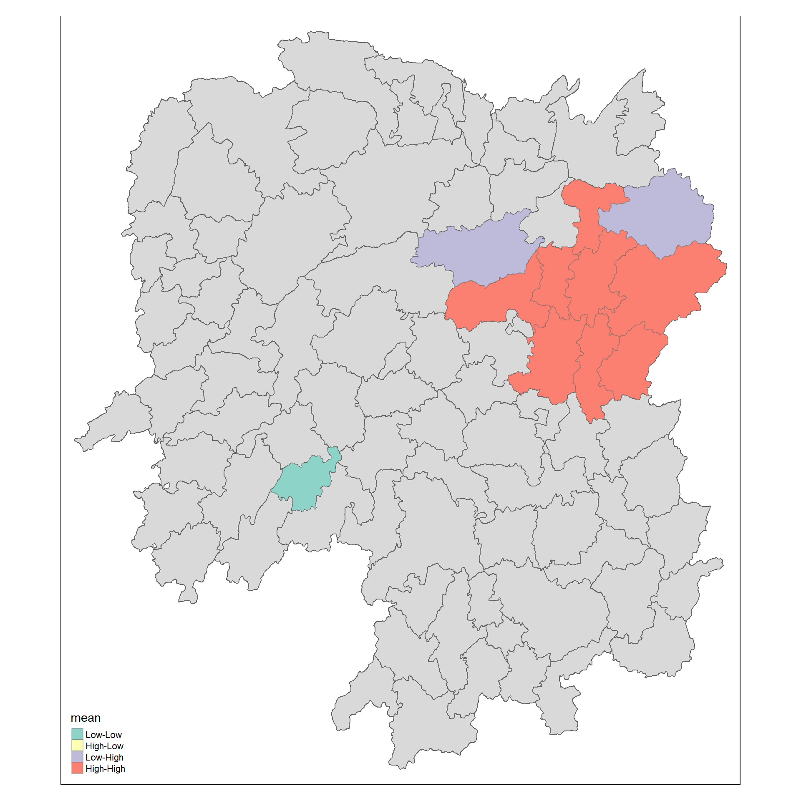
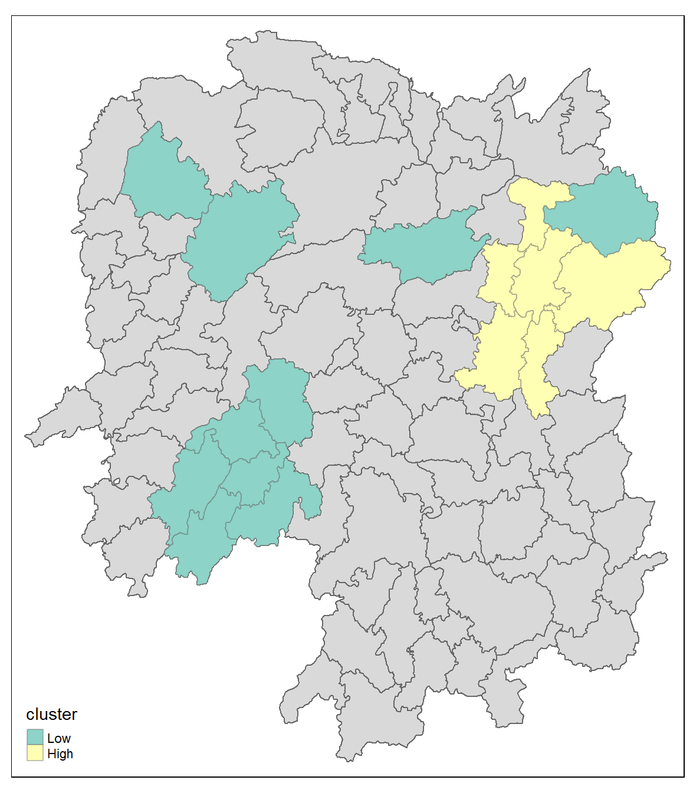

## Content

- Introducing [**sfdep**](https://josiahparry.github.io/sfdep/).
  - sfdep creates an sf and tidyverse friendly interface to the package as well as introduces new functionality that is not present in spdep.
  - sfdep utilizes list columns extensively to make this interface possible.

## Getting started

### Installing and Loading the R Packages

Four R packages will be used for this in-class exercise, they are: sf, sfdep, tmap and tidyverse.

:::: panel-tabset
### Do It Yourself!

Using the steps you learned in previous lesson, install and load **sf**, **tmap**, **sfdep** and **tidyverse** packages into R environment.

### The code

::: {style="font-size: 1.5em"}
```{r}
pacman::p_load(sf, sfdep, tmap, tidyverse)
```
:::
::::

## The Data

For the purpose of this in-class exercise, the Hunan data sets will be used. There are two data sets in this use case, they are:

- Hunan, a geospatial data set in ESRI shapefile format, and
- Hunan_2012, an attribute data set in csv format.

:::: panel-tabset
### Do It Yourself!

Using the steps you learned in previous lesson, import *Hunan* shapefile into R environment as an sf data frame.

### The code

::: {style="font-size: 1.5em"}
```{r}
hunan <- st_read(dsn = "data/geospatial", 
                 layer = "Hunan")
```
:::
::::

## Importing Attribute Table

:::: panel-tabset
### Do It Yourself!

Using the steps you learned in previous lesson, import *Hunan_2012.csv* into R environment as an tibble data frame.

### The code

::: {style="font-size: 1.5em"}
```{r}
hunan2012 <- read_csv("data/aspatial/Hunan_2012.csv")
```
:::
::::

## Combining both data frame by using left join

:::: panel-tabset
### Do It Yourself!

Using the steps you learned in previous lesson, combine the Hunan sf data frame and Hunan_2012 data frame. Ensure that the output is an sf data frame.

### The code

::: {style="font-size: 1.5em"}
```{r}
hunan_GDPPC <- left_join(hunan, hunan2012) %>%
  select(1:4, 7, 15, 33)
```
:::

::: callout-note
For the purpose of this exercise, we only retain column 1 to 4, column 7 and column 15. You should examine the output sf data.frame to learn know what are these fields.
:::

::: callout-important
In order to retain the geospatial properties, the left data frame must the sf data.frame (i.e. hunan)
:::
::::

## Plotting a choropleth map

:::: panel-tabset
### Do It Yourself!

Using the steps you learned in previous lesson, plot a choropleth map showing the distribution of GDPPC of Hunan Province.

### The plot

```{r}
#| fig-width: 9
#| fig-height: 7
#| fig-align: left
#| echo: false
tmap_mode("plot")
tm_shape(hunan_GDPPC) +
  tm_polygons(fill = "GDPPC", 
              fill.scale = tm_scale_intervals(
                style = "quantile", 
                values = "brewer.blues")) +
  tm_title("Distribution of GDP per capita by county, Hunan Province") +
  tm_borders(fill_alpha = 0.5) +
  tm_compass(type="8star", size = 2) +
  tm_scalebar() +
  tm_grid(fill_alpha =0.2) +
  tm_layout(legend.position = c("left", "bottom"))
```

### The code

::: {style="font-size: 1.5em"}
```{r}
#| fig-width: 10
#| fig-height: 8
#| fig-align: left
#| eval: false
tmap_mode("plot")
tm_shape(hunan_GDPPC) +
  tm_polygons(fill = "GDPPC", 
              fill.scale = tm_scale_intervals(
                style = "quantile", 
                values = "brewer.blues")) +
  tm_title("Distribution of GDP per capita by county, Hunan Province") +
  tm_borders(fill_alpha = 0.5) +
  tm_compass(type="8star", size = 2) +
  tm_scalebar() +
  tm_grid(fill_alpha =0.2) +
  tm_layout(legend.position = c("left", "bottom"))
```
:::
::::

## Global Measures of Spatial Association

### Deriving Queen's contiguity weights: sfdep methods

:::: columns
::: {.column width="50%"}
The code chunk below is used to compute the Queen's contiguity weightes.

::: {style="font-size: 1.35em"}
```{r}
wm_q <- hunan_GDPPC %>%
  mutate(nb = st_contiguity(geometry),
         wt = st_weights(nb,
                         style = "W"),
         .before = 1) 
```
:::

::: callout-note
It is a good practice to review the output datatable after the computation is done.
:::
:::

::: {.column width="50%"}
::: {style="font-size: 0.85em"}
Notice that [`st_weights()`](https://josiahparry.github.io/sfdep/reference/st_weights.html) requires three inputs, they are:

- *nb*: A neighbor list object as created by [`st_contiguity()`](https://josiahparry.github.io/sfdep/reference/st_contiguity.html).
- *style*: Default "W" for row standardized weights. This value can also be "B", "C", "U", "minmax", and "S". B is the basic binary coding, W is row standardised (sums over all links to n), C is globally standardised (sums over all links to n), U is equal to C divided by the number of neighbours (sums over all links to unity), while S is the variance-stabilizing coding scheme proposed by Tiefelsdorf et al. 1999, p. 167-168 (sums over all links to n).
- *allow_zero*: If TRUE, assigns zero as lagged value to zone without neighbors.
:::
:::
::::

------------------------------------------------------------------------

### Computing Global Moran' I

:::: columns
::: {.column width="65%"}
In the code chunk below, [`global_moran()`](https://josiahparry.github.io/sfdep/reference/global_moran.html) function is used to compute the Moran's I value. Different from spdep package, the output is a tibble data.frame.

::: {style="font-size: 1.5em"}
```{r}
moranI <- global_moran(wm_q$GDPPC,
                       wm_q$nb,
                       wm_q$wt)
glimpse(moranI)
```
:::
:::
::::

------------------------------------------------------------------------

### Performing Global Moran's I test

In general, Moran's I test will be performed instead of just computing the Moran's I statistics. With sfdep package, Moran's I test can be performed by using [`global_moran_test()`](https://josiahparry.github.io/sfdep/reference/global_moran_test.html) as shown in the code chunk below.

:::: panel-tabset

#### The code

::: {style="font-size: 1.5em"}
```{r}
#| eval: false
global_moran_test(wm_q$GDPPC,
                       wm_q$nb,
                       wm_q$wt)
```
:::

#### The output

::: {style="font-size: 1.20em"}
```{r}
#| echo: false
global_moran_test(wm_q$GDPPC,
                       wm_q$nb,
                       wm_q$wt)
```
:::

#### Tips

::: callout-tip
- The default for `alternative` argument is "two.sided". Other supported arguments are "greater" or "less". randomization, and
- By default the `randomization` argument is **TRUE**. If FALSE, under the assumption of normality.
:::
::::

------------------------------------------------------------------------

### Performing Global Moran'I permutation test

In practice, Monte Carlo simulation should be used to perform the statistical test. For **sfdep**, it is supported by [`globel_moran_perm()`](https://josiahparry.github.io/sfdep/reference/global_moran_perm.html) function.

:::: panel-tabset

#### The codes

::: {style="font-size: 1.5em"}
```{r}
#| output: false
set.seed(1234)

global_moran_perm(wm_q$GDPPC,
                       wm_q$nb,
                       wm_q$wt,
                  nsim = 99)
```
:::

::: callout-tip
#### Reminder

- It is always a good practice to use `set.seed()` before performing simulation. This is to ensure that the computation is reproducible.
- The numbers of simulation is alway equal to nsim + 1. This mean in nsim = 99. This mean 100 simulation will be performed.
:::

#### The report

:::: columns
::: {.column width = "50%"}

::: {style="font-size: 1.5em"}
```{r}
#| echo: false
global_moran_perm(wm_q$GDPPC,
                       wm_q$nb,
                       wm_q$wt,
                  nsim = 99)
```
:::
:::

::: {.column width="45%"}
::: callout-note
#### Interpretation

- The statistical report on the left shows that the p-value is smaller than alpha value of 0.05. Hence, we have enough statistical evidence to reject the null hypothesis that the spatial distribution of GPD per capita resembles a random distribution (i.e. independent from spatial).
- Because the Moran’s I statistic is greater than 0 (positive spatial autocorrelation), it confirms a clustered pattern. This means similar values are near each other (high GDP per capita counties are next to other high GDP counties, and low next to low).
:::
:::
::::
::::

## Computing local Moran's I

In this section, you will learn how to compute Local Moran's I of GDPPC at county level by using [`local_moran()`](https://josiahparry.github.io/sfdep/reference/local_moran.html) of sfdep package.

:::: panel-tabset
### The code

::: {style="font-size: 1.5em"}
```{r}
lisa <- wm_q %>% 
  mutate(local_moran = local_moran(
    GDPPC, nb, wt, nsim = 99),
         .before = 1) %>%
  unnest(local_moran)
```
:::

### The output

::: {style="font-size: 0.7em"}
The output of `local_moran()` is a sf data.frame containing the columns ii, eii, var_ii, z_ii, p_ii, p_ii_sim, and p_folded_sim.

- ii: local moran statistic
- eii: expectation of local moran statistic; for localmoran_permthe permutation sample means
- var_ii: variance of local moran statistic; for localmoran_permthe permutation sample standard deviations
- z_ii: standard deviate of local moran statistic; for localmoran_perm based on permutation sample means and standard deviations p_ii: p-value of local moran statistic using pnorm(); for localmoran_perm using standard deviatse based on permutation sample means and standard deviations p_ii_sim: For `localmoran_perm()`, `rank()` and `punif()` of observed statistic rank for \[0, 1\] p-values using `alternative=` -p_folded_sim: the simulation folded \[0, 0.5\] range ranked p-value (based on https://github.com/pysal/esda/blob/4a63e0b5df1e754b17b5f1205b cadcbecc5e061/esda/crand.py#L211-L213)
- skewness: For `localmoran_perm`, the output of e1071::skewness() for the permutation samples underlying the standard deviates
- kurtosis: For `localmoran_perm`, the output of e1071::kurtosis() for the permutation samples underlying the standard deviates.
:::
::::

------------------------------------------------------------------------

### Visualising local Moran's I

:::: columns
::: {.column width="50%"}
Code chunk on the left uses tmap functions to prepare a choropleth map by using value in the *ii* field of *lisa* sf data frame.

::: {style="font-size: 1.20em"}
```{r}
#| eval: false
#| fig-width: 8
tmap_mode("plot")
tm_shape(lisa) +
  tm_polygons(fill = "ii",
              fill.scale = tm_scale_intervals(
                style = "fixed", 
                breaks = c(
                  -2, -1, 0, 1, 2, 3, 4, 5),
                values = "brewer.rd_bu"),
              fill.legend = tm_legend(
                title = "Local Moran's I")) + 
                tm_borders(fill_alpha = 0.5) +
  tm_view(set_zoom_limits = c(6,8)) + 
  tm_title("local Moran's I of GDPPC") +
  tm_layout(legend.text.size = 1.2)
```
:::
:::

::: {.column width = "50%"}

```{r}
#| echo: false
#| fig-height: 10
tmap_mode("plot")
tm_shape(lisa) +
  tm_polygons(fill = "ii",
              fill.scale = tm_scale_intervals(
                style = "fixed", 
                breaks = c(
                  -2, -1, 0, 1, 2, 3, 4, 5),
                values = "brewer.rd_bu"),
              fill.legend = tm_legend(
                title = "Local Moran's I")) + 
                tm_borders(fill_alpha = 0.5) +
  tm_view(set_zoom_limits = c(6,8)) + 
  tm_title("local Moran's I of GDPPC") +
  tm_layout(legend.text.size = 1.2)
```
:::
::::

------------------------------------------------------------------------

### Visualising p-value of local Moran's I

:::: columns
::: {.column width="50%"}
In the code chunk below, tmap functions are used prepare a choropleth map by using value in the *p_ii_sim* field.

::: {style="font-size: 1.25em"}
```{r}
#| eval: false
tmap_mode("plot")
tm_shape(lisa) +
  tm_polygons(fill = "p_ii_sim") +
  tm_borders(fill_alpha = 0.5) +
  tm_title("p-value of local Moran's I") +
  tm_layout(legend.title.size = 1.5)
```
:::

::: callout-warning
For p-values, the appropriate classification should be 0.001, 0.01, 0.05 and not significant instead of using default classification scheme.
:::
:::

::: {.column width="50%"}
```{r}
#| echo: false
#| fig-height: 10
tmap_mode("plot")
tm_shape(lisa) +
  tm_polygons(fill = "p_ii_sim") +
  tm_borders(fill_alpha = 0.5) +
  tm_title("p-value of local Moran's I") +
  tm_layout(legend.title.size = 1.5)
```
:::
::::

------------------------------------------------------------------------

### Visualising local Moran's I and p-value

For effective comparison, it will be better for us to plot both maps next to each other.

:::: columns
::: {.column width="50%"}
```{r}
#| echo: false
#| fig-height: 8
tm_shape(lisa) +
  tm_polygons(fill = "ii",
              fill.scale = tm_scale_intervals(
                style = "fixed", 
                breaks = c(
                  -2, -1, 0, 1, 2, 3, 4, 5),
                values = "brewer.rd_bu"),
              fill.legend = tm_legend(
                title = "Local Moran's I")) +
  tm_borders(fill_alpha = 0.5) +
  tm_view(set_zoom_limits = c(6,8)) + 
  tm_title("local Moran's I of GDPPC") +
  tm_layout(legend.text.size = 1.2)
```
:::

::: {.column width="50%"}
```{r}
#| echo: false
#| fig-height: 8
tm_shape(lisa) +
  tm_polygons(fill = "p_ii_sim",
              fill.scale = tm_scale_intervals(
                style = "fixed", 
                breaks = c(
                  0, 0.0011, 0.011, 0.051, 1),
                values = "-Blues"),
              fill.legend = tm_legend(
                title = "p-values",
                text.size = 1.15,
                width = 10)) +
  tm_borders(fill_alpha = 0.5) +
  tm_title("p-value of local Moran's I") +
  tm_layout(legend.title.size = 1.25)
```
:::
::::

## LISA map

:::: columns
::: {.column width="50%"}
LISA map is a categorical map showing **outliers** and **clusters**. There are two types of outliers namely: High-Low and Low-High outliers. Likewise, there are two type of clusters namely: High-High and Low-Low cluaters. In fact, LISA map is an interpreted map by combining local Moran's I of geographical areas and their respective p-values.
:::

::: {.column width="50%"}

:::
::::

------------------------------------------------------------------------

### Plotting LISA map

:::: columns
::: {.column width="50%"}
In lisa sf data.frame, we can find three fields contain the LISA categories. They are *mean*, *median* and *pysal*. In general, classification in *mean* will be used as shown in the code chunk below.

::: {style="font-size: 1.25em"}
```{r}
#| eval: false
lisa_sig <- lisa  %>%
  filter(p_ii_sim < 0.05)
tmap_mode("plot")
tm_shape(lisa) +
  tm_polygons() +
  tm_borders(fill_alpha = 0.5) +
tm_shape(lisa_sig) +
  tm_polygons(fill = "mean", 
          fill.legend = tm_legend(
            text.size = 1.15,
            width = 6)) + 
  tm_borders(fill_alpha = 0.4) +
  tm_layout(legend.title.size = 1.25)
```
:::
:::

::: {.column width="50%"}
```{r}
#| echo: false
#| fig-height: 11
lisa_sig <- lisa  %>%
  filter(p_ii_sim < 0.05)
tmap_mode("plot")
tm_shape(lisa) +
  tm_polygons() +
  tm_borders(fill_alpha = 0.5) +
tm_shape(lisa_sig) +
  tm_polygons(fill = "mean", 
          fill.legend = tm_legend(
            text.size = 1.15,
            width = 6)) + 
  tm_borders(fill_alpha = 0.4) +
  tm_layout(legend.title.size = 1.25)
```
:::
::::

## Hot Spot and Cold Spot Area Analysis (HCSA)

:::: columns
::: {.column width="50%"}
- HCSA uses spatial weights to identify locations of statistically significant hot spots and cold spots in an spatially weighted attribute that are in proximity to one another based on a calculated distance.

- The analysis groups features when similar high (hot) or low (cold) values are found in a cluster. The polygon features usually represent administration boundaries or a custom grid structure.
:::

::: {.column width="50%"}
{width="640"}
:::
::::

------------------------------------------------------------------------

### Computing local Gi\* statistics

As usual, we will need to derive a spatial weight matrix before we can compute local Gi\* statistics. Code chunk below will be used to derive a spatial weight matrix by using sfdep functions and tidyverse approach.

::: {style="font-size: 1.5em"}
```{r}
wm_idw <- hunan_GDPPC %>%
  mutate(nb = include_self(
    st_contiguity(geometry)),
    wts = st_inverse_distance(nb, 
                              geometry, 
                              scale = 1,
                              alpha = 1),
         .before = 1)
```
:::

::: callout-note
- Gi\* and local Gi\* are distance-based spatial statistics. Hence, distance methods instead of contiguity methods should be used to derive the spatial weight matrix.
- Since we are going to compute Gi\* statistics, `include_self()`is used.
:::

------------------------------------------------------------------------

### Computing local Gi\* statistics

Now, we will compute the local Gi\* by using the code chunk below.

::: {style="font-size: 1.5em"}
```{r}
HCSA <- wm_idw %>% 
  mutate(local_Gi = local_gstar_perm(
    GDPPC, nb, wts, nsim = 99),
         .before = 1) %>%
  unnest(local_Gi)
```
:::

------------------------------------------------------------------------

### Visualising Gi\*

:::: columns
::: {.column width="50%"}
In the code chunk below, tmap functions are used to plot the local Gi\* (i.e. gi_star) at the county level.

::: {style="font-size: 1.5em"}
```{r}
#| eval: false
tmap_mode("plot")
tm_shape(HCSA) +
  tm_fill("gi_star") + 
  tm_borders(fill_alpha = 0.5) +
  tm_view(set.zoom.limits = c(6,8)) +
  tm_title(
    "local G*i for GDP per capita")
```
:::
:::

::: {.column width="50%"}
```{r}
#| echo: false
#| fig-height: 10
tmap_mode("plot")
tm_shape(HCSA) +
  tm_fill("gi_star") + 
  tm_borders(fill_alpha = 0.5) +
  tm_view(set.zoom.limits = c(6,8)) +
  tm_title(
    "local G*i for GDP per capita")
```
:::
::::

------------------------------------------------------------------------

### Visualising p-value of local G\*i

:::: panel-tabset
### The plot

```{r}
#| echo: false
#| fig-height: 7
tmap_mode("plot")
tm_shape(HCSA) +
  tm_polygons(
    fill = "p_sim",
    fill.scale = tm_scale_intervals(
      breaks = c(0, 0.001, 0.01, 0.05, 1.0),
      labels = c("p < 0.001", "p < 0.01", "p < 0.05", "Not Significant"),
      values = c("#de2d26", "#fc9272", "#fee0d2", "#e0e0e0")),
    fill.legend = tm_legend(
      title = "p-values")
    ) + 
  tm_title("p-values of G*i for GDP per capita") +
  tm_borders(fill_alpha = 0.5)
```

### The codes

In the code chunk below, tmap functions are used to plot the p-values of local Gi\* (i.e. p_sim) at the county level.

::: {style="font-size: 1.35em"}
```{r}
#| eval: false
tmap_mode("plot")
tm_shape(HCSA) +
  tm_polygons(
    fill = "p_sim",
    fill.scale = tm_scale_intervals(
      breaks = c(0, 0.001, 0.01, 0.05, 1.0),
      labels = c("p < 0.001", "p < 0.01", "p < 0.05", "Not Significant"),
      values = c("#de2d26", "#fc9272", "#fee0d2", "#e0e0e0")),
    fill.legend = tm_legend(
      title = "p-values")
    ) + 
  tm_title("p-values of G*i for GDP per capita") +
  tm_borders(fill_alpha = 0.5)
```
:::
::::

------------------------------------------------------------------------

### Visuaising local HCSA

For effective comparison, you can plot both maps next to each other as shown below.

:::: columns
::: {.column width="50%"}
```{r}
#| echo: false
#| fig-height: 10
tmap_mode("plot")
tm_shape(HCSA) +
  tm_fill("gi_star") + 
  tm_borders(fill_alpha = 0.5) +
  tm_view(set.zoom.limits = c(6,8)) +
  tm_title(
    "local G*i values for GDP per capita")
```
:::

::: {.column width="50%"}
```{r}
#| echo: false
#| fig-height: 10
tmap_mode("plot")
tm_shape(HCSA) +
  tm_polygons(
    fill = "p_sim",
    fill.scale = tm_scale_intervals(
      breaks = c(0, 0.001, 0.01, 0.05, 1.0),
      labels = c("p < 0.001", "p < 0.01", "p < 0.05", "Not Significant"),
      values = c("#de2d26", "#fc9272", "#fee0d2", "#e0e0e0")),
    fill.legend = tm_legend(
      title = "p-values")
    ) + 
  tm_title("p-values of G*i for GDP per capita") +
  tm_borders(fill_alpha = 0.5)
```
:::
::::

------------------------------------------------------------------------

### Visualising hot spot and cold spot areas

:::: columns
::: {.column width="50%"}
Now, we are ready to plot the significant (i.e. p-values less than 0.05) hot spot and cold spot areas.

::: {style="font-size: 1.25em"}
```{r}
#| eval: false
HCSA_sig <- HCSA  %>%
  filter(p_sim < 0.05)
tmap_mode("plot")
tm_shape(HCSA) +
  tm_polygons() +
  tm_borders(fill_alpha = 0.5) +
tm_shape(HCSA_sig) +
  tm_polygons(fill = "cluster") + 
  tm_borders(fill_alpha = 0.4) +
  tm_title("Hot and Cold Spots map for GDP per capita")
```
:::

::: callout-note
Figure on the right reveals that there are six hot spot area and eight cold spot areas. Interestingly, the hot spot areas coincide with the High-high cluster identifies by using local Moran's I method in the earlier sub-section.
:::
:::

::: {.column width="50%"}
```{r}
#| echo: false
#| fig-height: 10
HCSA_sig <- HCSA  %>%
  filter(p_sim < 0.05)
tmap_mode("plot")
tm_shape(HCSA) +
  tm_polygons() +
  tm_borders(fill_alpha = 0.5) +
tm_shape(HCSA_sig) +
  tm_polygons(fill = "cluster") + 
  tm_borders(fill_alpha = 0.4) +
  tm_title("Hot and Cold Spots map for GDP per capita")
```
:::
::::
