# Content

- Introduction to Spatial Weights
- Contiguity-Based Spatial Weights
  - Rook's
  - Queen's
- Distance-Band Spatial Weights
- Applications of Spatial Weights

::: notes
This lesson consists of three main sections. First, I am going to explain the basic concept of spatial weights. This is followed by a discussion on various methods used to compute spatial weights. Lastly, the applications of spatial wiehgts will be discussed.
:::

## What is geographically referenced attribute?

::::: columns
::: {.column width="50%"}
Geographically referenced attributes are descriptive data items linked to a specific physical location on the Earth's surface

- Geographic Reference (Location): The coordinates, address, or boundary that place an object in a specific spot on the globe (e.g., county boundary).
- Attributes (Characteristics): Descriptive information answering questions like who, what, when, or how much about that location (i.e. GDP per capita).
:::

::: {.column width="50%"}
```{r}
pacman::p_load(ggstatsplot, DT, sf, sp, GWmodel, tmap, tidyverse)
```

```{r}
#| output: false 
hunan <- st_read(dsn = "data/geospatial", 
                 layer = "Hunan")

hunan2012 <- read_csv("data/aspatial/Hunan_2012.csv")

hunan <- left_join(hunan,hunan2012) %>%
  select(1:4, 7, 15, 31)
```

```{r}
#| fig-width: 7
#| fig-height: 9
qtm(hunan, "GDPPC") +
  tm_layout(
    legend.position = c("left", "bottom"))
```
:::
:::::

::: notes
A kind of data that is very similar to an ordinary data. The only difference is that each observation is associated with some form of geography such as numbers of aged population by planning subzone.
:::

------------------------------------------------------------------------

### Describing attribute distribution

::::: columns
::: {.column width="50%"}
#### Non-geographical

Are the distribution of GDP per capita by county resemble normally distributed?

```{r}
#| fig-height: 7.5
gghistostats(data = hunan, 
             x = GDPPC,
             xlab = "GDP Per Capita",
             results.subtitle = FALSE,
             centrality.parameter = "mean"
             )

```
:::

::: {.column width="50%"}
#### Geographical

Are the distribution of GDP per capita by country randomly distributed over space?

```{r}
#| fig-height: 7.5
tm_shape(hunan)+
  tm_fill("GDPPC", 
          style = "quantile", 
          palette = "Blues",
          title = "GDPPC") +
  tm_borders(fill_alpha = 0.25,
             lwd = 0.5) +
  tm_title("Distribution of GDP per capita by county, Hunan Province, People Republic of China") + tm_layout(legend.position = c("left", "bottom"))
```
:::
:::::

::: notes
In statistics, we are interested to study if the observed distribution resemble normal distribution. To provide an answer to the question, we have to go beyond EDA and apply Confirmatory Data Analysis or also know as statistical test to confirm the observated pattern is indeed resemble normal distribution.

When come of geographically referenced attributes, beside the distribution of the value, we are also interested to find out if the observed geographical patterns are randomly distributed. Similarly to statistical, geovisualisation is not enough because the visual impression will change when different data classification methods is used.
:::

## What are Spatial Weights *(wij)*

- A way to define spatial neighbourhood.

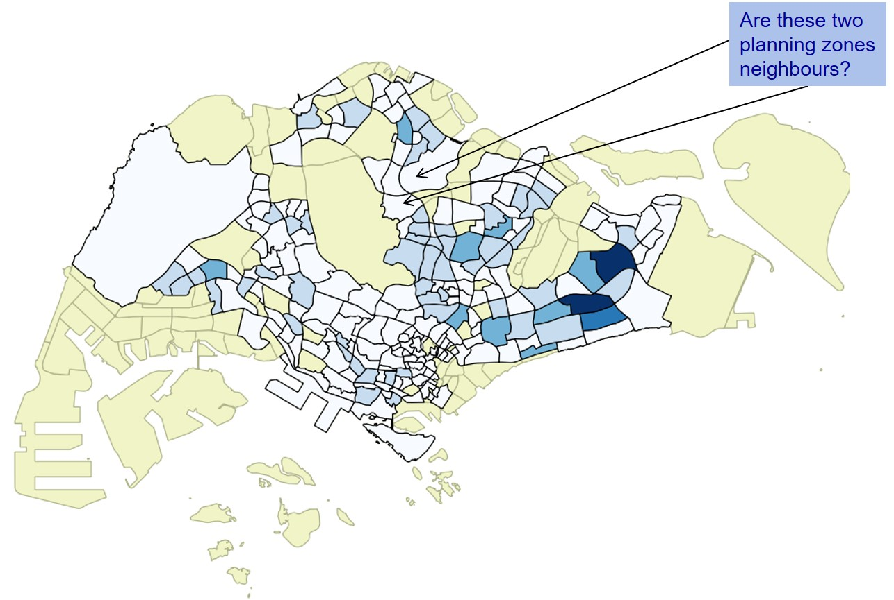

::: notes
Before we can perform statistics test of spatial randomness, we need to understand how spatial relationship among geographical areas can be defined mathematically.
:::

------------------------------------------------------------------------

### Defining Spatial Weights

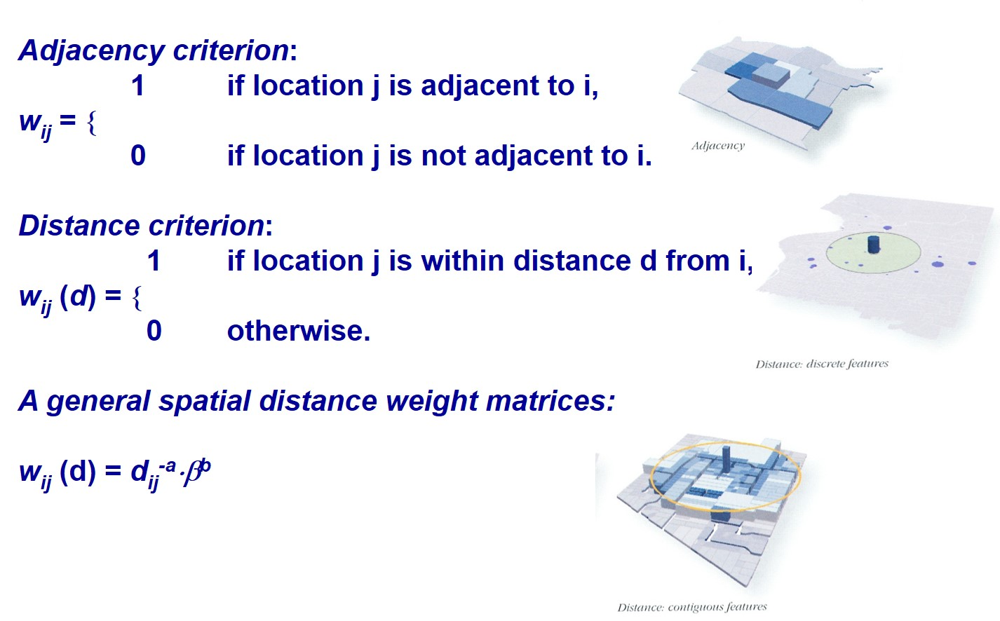

::: notes
There are at least two popular methods can be used to define spatial weights of geographical areas. They are contiguity and distance. Both of them are encoded in binary.

According to contiguity principle, two geographical areas are consider as neighbour if they share a common boundary. Hence, if two geographical areas are neighbour, they will be indicated as 1. On the other hand, if the two geographical areas are not neighbour, they will be indicated as 0.

According to distance principle, two geographical areas are consider as neighbour if their centroid as within a spefic distance. Hence, if two geographical areas are neighbour, they will be indicated as 1. On the other hand, if the two geographical areas are not neighbour, they will be indicated as 0.
:::

------------------------------------------------------------------------

### Contiguity Neighbours

- Contiguity (common boundary)

- What is a "shared" boundary?

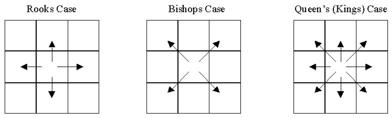

::: notes
This figure shows three different ways to define contiguity neighbours. They are Rooks, Bishop and Queens methods. Rooks and Queens are the two commonly used methods.\
The main different between Queens and Rooks is that Rooks only consider geographical areas that shared common boundaries but Queens method includes geographical areas touching at the tips of the target geographical area.
:::

------------------------------------------------------------------------

### Beyond the basic contiguity neighbours

There are also second-order, third-order, forth-order, etc contiguity

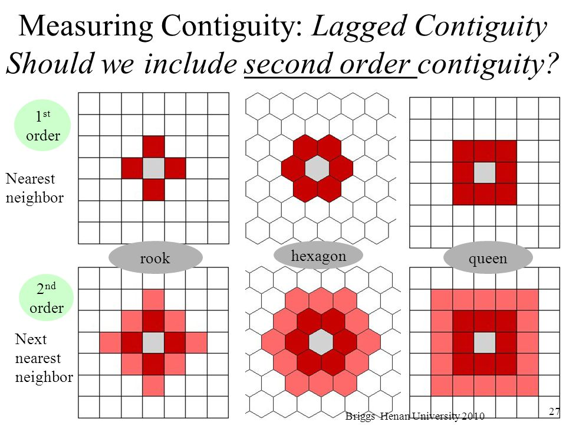

::: notes
The figure show contiguity neighbours beyond the first order. As you can see that the second-order contiguity neighbours are also defined according to Rooks and Queens case.
:::

------------------------------------------------------------------------

### Weights matrix: Adjacency-based neighbours

**Quiz**: With reference to the figure below, list down the neighbour(s) of area 1202 using Rook case.

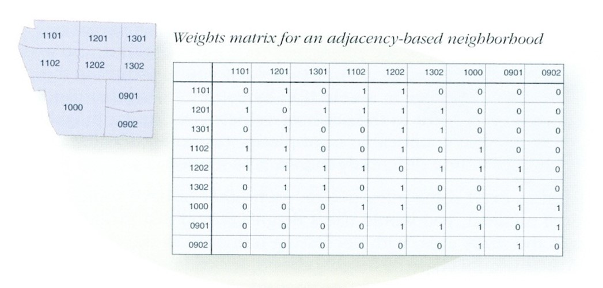

::: notes
This figure shows a geographical area with nine locations. Let us focus on location 1202. According to Queens case, it has seven neighbours. They are 1101, 1201, 1301, 1102, 1302, 1000, and 0901. If Rooks case is consider, 1101 and 1301 will not be considered as neighbours because they do not share common boundaries with 1202.
:::

------------------------------------------------------------------------

### Weights Matrix: Distance-based neighbours

**Quiz:** With reference to the figure below, create a weights matrix for d = 650.

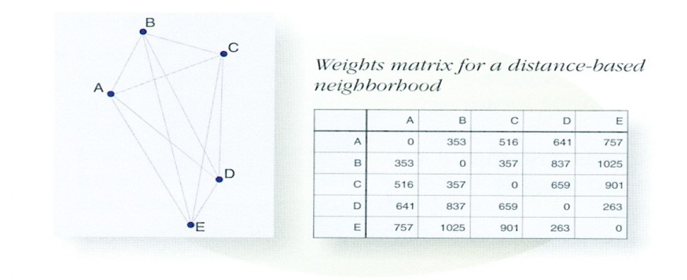

::: notes
In this figure, a cut-off distance of 650m is used. In this case, locations B, C and D are considered as neighbours of location A because all of them are with the 650m distance from A. On the other hand, location E is not a neighbour of location A because their distance is 757m apart.
:::

------------------------------------------------------------------------

### Weights matrix: Measured distances

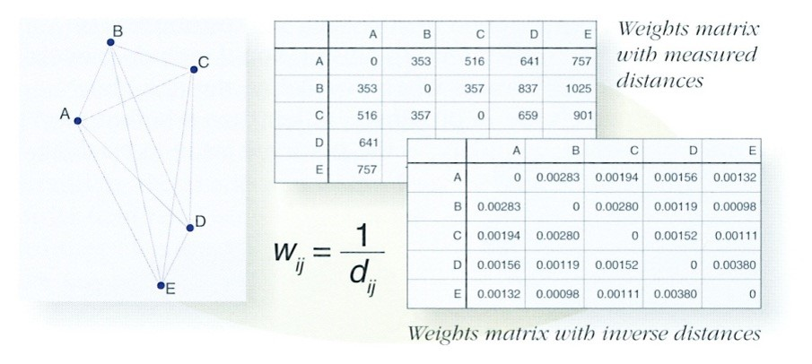

::: notes
In this figure, spatial weights are calculated as the inversed function of the distance. In other word, two locations that are closer will be given higher weight than two locations that are further away. For example, the distance of AB is 353 and the diatnce of AE is 757 and the spatial weights are 0.00283 and 0.00132 respectively.
:::

------------------------------------------------------------------------

### Row standardisation

In practice, row-standardised weights instead of spatial weights will be used.

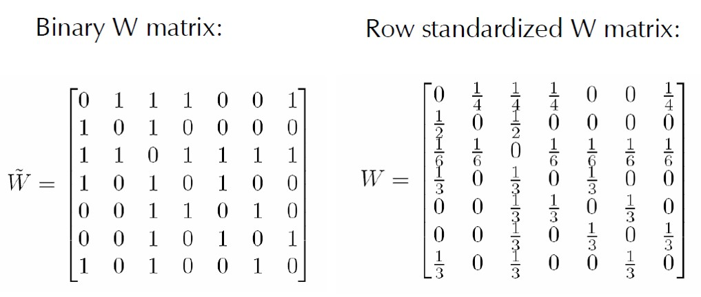

::: notes
Row-standardised weights increase the influence of links from observations with few neighbours, which binary weights vary the influence of observations. + Those with many neighbours are up-weighted compared to those with few. + In this case, raw 1 have four neighbours, hence each neighbour will have a value of 1/4. On the other hand, row number 2, has only two neighbour, hence each neighbour will be given a value of 1/2.
:::

## Applications of Spatial Weights

- Spatially lagged variable
- Geographically weighted summary statistics
- Geographically weighted correlation

## Spatially Lagged Variable

A spatially lagged variable is a weighted sum or average of a variable's values from neighboring locations.

Formally, for observation i, the spatial lag of yi, referred to as \[Wy\]i (the variable Wy observed for location i) is:

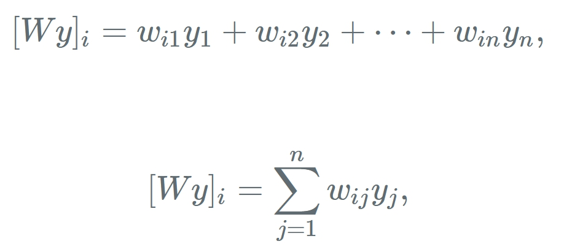{width="320"}

where the weights wij consist of the elements of the i-th row of the matrix W, matched up with the corresponding elements of the vector y.

::: notes
With a neighbor structure defined by the non-zero elements of the spatial weights matrix W, a **spatially lagged variable** is a weighted sum or a weighted average of the neighboring values for that variable. In most commonly used notation, the spatial lag of y is then expressed as Wy.
:::

---

### Spatially Lagged Variable

:::: columns
::: {.column width = "50%"}
**How It Works?**

- The Spatial Weights Matrix (W): This grid or matrix defines who your "neighbors" are and how much influence they carry (e.g., sharing a border or being within 5 kilometers).
- The Calculation (Wy or Wx): You multiply the weights matrix by your data vector (y for a dependent variable, or X for an independent variable).
- The Result: For any given place, the spatial lag gives you a single number representing the surrounding neighborhood's average value for that trait.
:::

::: {.column width = "50%"}
**Why It Matters?**

- Captures Spillovers: It lets statistical models test if a neighbor's property values, crime rates, or rainfall levels directly affect your location.
- Fixes Bias: Standard regression assumes data points are independent. When places influence each other (spatial autocorrelation), ignoring this creates biased results. Adding a spatial lag helps clean up the model.

:::
::::

------------------------------------------------------------------------

### Spatially Lagged Variables

Spatial lag with row-standardized weights.

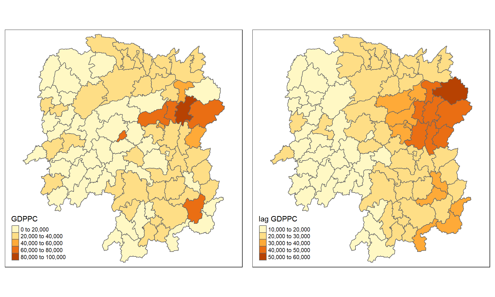

::: notes
This figure shows the spatially lagged of GPDPC summed up the GDPPC of all its neighbours except the target location itself.
:::

------------------------------------------------------------------------

### Spatial window sum

The spatial window sum uses and includes the diagonal element.

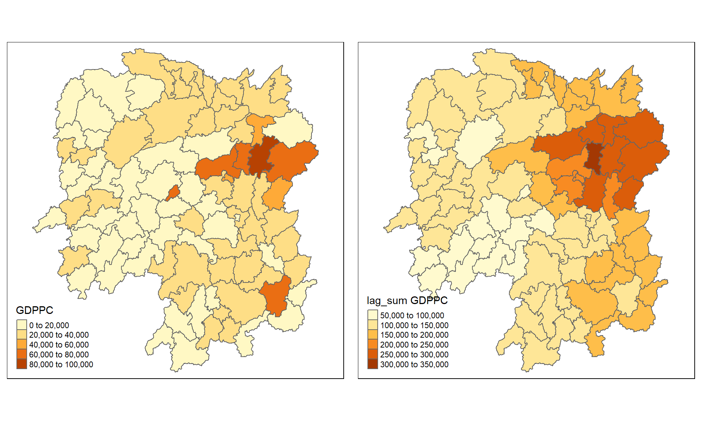

::: notes
Spatial window sum, on the other hand, summed up the GDPPC of all neighbours and include the target location itself.
:::

## Geographical Weighted Summary Statistics

The idea behind geographically weighted statistics is simple. For example, instead of calculating the (global) mean average for all of the data, and therefore for the whole map, a series of (local) averages are calculated for various sub-spaces within the map. Those location specific averages can then be compared.

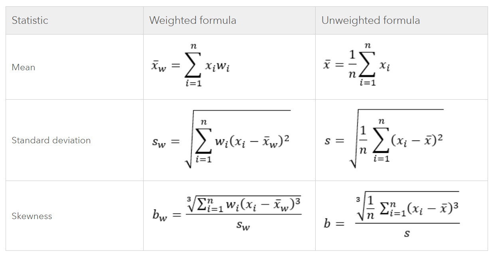

------------------------------------------------------------------------

### The kernel

A kernel is a mathematical function that determines how data points are weighted based on their distance from a specific target location.

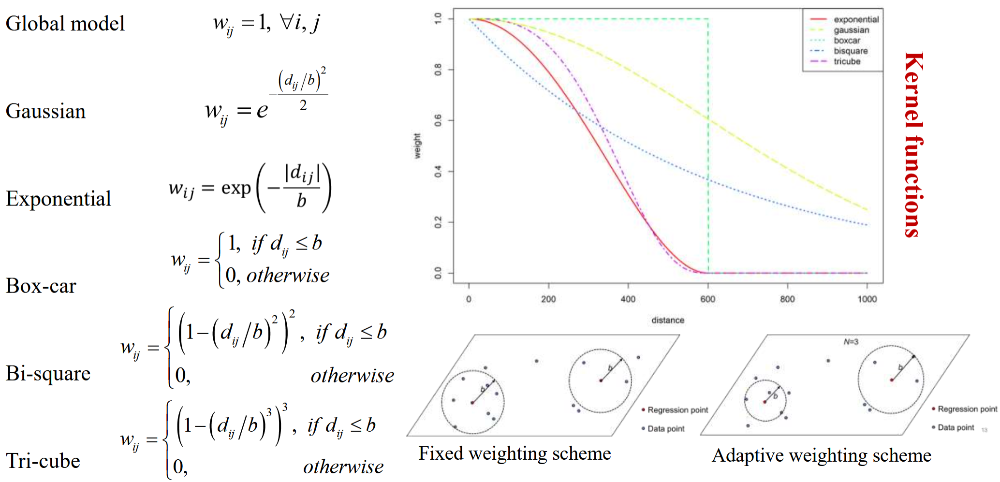

------------------------------------------------------------------------

### An example of Geographically Weighted Mean

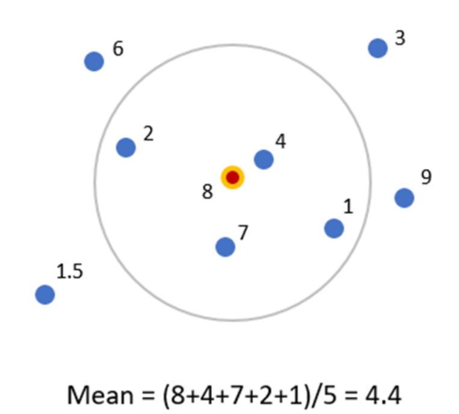

--- 

### Visualising Geographically Weighted Mean 


```{r}
hunan_sp <- as(hunan, "Spatial")

gwss_GDPPC <- gwss(hunan_sp, 
                   vars = "GDPPC", 
                   bw = 22,
                   quantile = TRUE,
                   adaptive = TRUE)

gwss_df <- as.data.frame(gwss_GDPPC$SDF)
hunan_gwss <- cbind(hunan, gwss_df)
```

:::: columns
::: {.column width="50%"}
```{r}
#| fig-width: 7
#| fig-height: 8
tm_shape(hunan_gwss) + 
  tm_polygons(
    fill = "GDPPC",
    fill.scale = tm_scale_intervals(
      n = 7,
      style = "quantile",
      values = "tableau.classic_orange")) +
  tm_borders(fill_alpha = 0.25,
             lwd = 0.5) +
  tm_title("Distribution of GDP per capita") +
  tm_layout(legend.position = c("left", "bottom"))
```
:::

::: {.column width="50%"}
```{r}
#| fig-width: 7
#| fig-height: 8
tm_shape(hunan_gwss) + 
  tm_polygons(
    fill = "GDPPC_LM",
    fill.scale = tm_scale_intervals(
      n = 7,
      style = "quantile",
      values = "tableau.classic_blue")) +
  tm_borders(fill_alpha = 0.25,
             lwd = 0.5) +
  tm_title("Distribution of geographically weighted mean") +
  tm_layout(legend.position = c("left", "bottom"))
```
:::
:::::

## Geographically Weighted Robust Statistics

::::: columns
::: {.column width="50%"}
- Geographically weighted robust statistics combine local spatial weighting with outlier-resistant calculations to geographically referenced data characteristics across space without being skewed by extreme values.

- All robust statistics depend on the definition of a weighted p-quantile, where p is between 0 and 1.

- This definition is used to calculate the weighted median (p=0.5), first quartile (p=0.25), and third quartile (p=0.75).
:::

::: {.column width="50%"}
The p-quantile for a given p is defined as the following:

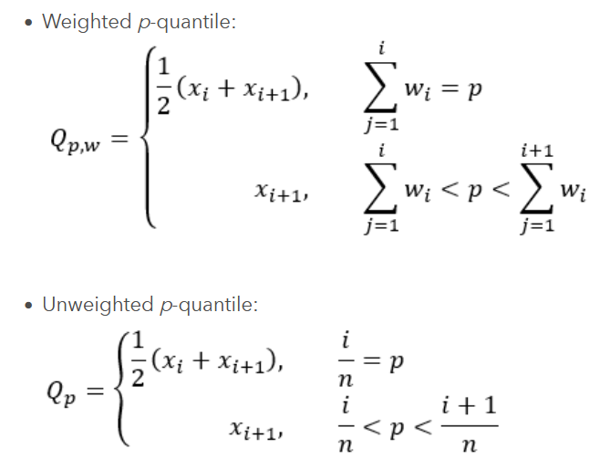
:::
:::::

------------------------------------------------------------------------

### Geographically Weighted Robust Statistics

Using the definition of the p-quantile in previous slide, the following table shows the weighted and unweighted version of each robust summary statistic.

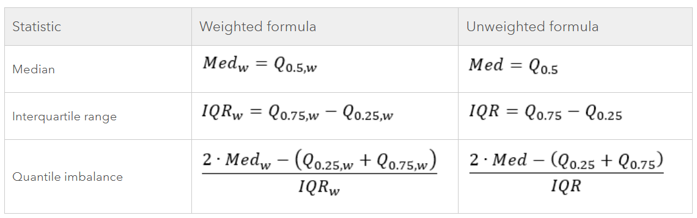


---

### Visualising Geographically Weighted Median

:::: columns
::: {.column width="50%"}

```{r}
#| fig-width: 7
#| fig-height: 8
tm_shape(hunan_gwss) + 
  tm_polygons(
    fill = "GDPPC",
    fill.scale = tm_scale_intervals(
      n = 7,
      style = "quantile",
      values = "tableau.classic_orange")) +
  tm_borders(fill_alpha = 0.25,
             lwd = 0.5) +
  tm_title("Distribution of GDP per capita") +
  tm_layout(legend.position = c("left", "bottom"))
```
:::

::: {.column width="50%"}
```{r}
#| fig-width: 7
#| fig-height: 8
tm_shape(hunan_gwss) + 
  tm_polygons(
    fill = "GDPPC_Median",
    fill.scale = tm_scale_intervals(
      n = 7,
      style = "quantile",
      values = "tableau.classic_blue")) +
  tm_borders(fill_alpha = 0.25,
             lwd = 0.5) +
  tm_title("Distribution of geographically weighted median") +
  tm_layout(legend.position = c("left", "bottom"))
```
:::
:::::

## Geographically Weighted Correlation

Geographically weighted correlation is a local statistical method used to measure how the strength and direction of a relationship between two variables changes across different geographic locations.

**Key Concepts**

- **Spatial Non-Stationary**: It recognizes that the relationship between two factors (such as income and health outcomes) is not uniform and can vary from one neighborhood or region to another.
- **Distance Decay (Weighting)**: It follows **Tobler's First Law of Geography**, meaning things closer to a location have a higher impact on the local correlation value than things far away.
- **Bandwidth and Kernel**: A defined spatial window (bandwidth) and a weighting function (kernel) are used to dictate how quickly the influence of neighboring points decreases over distance.

---

### Correlation Analysis

:::: columns
::: {.column width = "80%"}
Business question: Is there any relationship between GDP per capita and Gross Agriculture Output?

```{r}
#| fig-height: 7.5
ggscatterstats(
  data = hunan2012,
  x = Agri,
  y = GDPPC,
  xlab = "Gross Agriculture Output",
  ylab = "GDP per capita",
  label.var = County,
  label.expression = Agri > 10000 & GDPPC > 50000,
  point.label.args = list(alpha = 0.7, size = 4, color = "grey50"),
  xfill = "#CC79A7",
  yfill = "#009E73",
  title = "Relationship between GDP PC and Gross Agriculture Output")

```
:::
::::

------------------------------------------------------------------------

### GeoVisualisation of the variable

:::: columns
::: {.column width="50%"}

```{r}
#| fig-width: 7
#| fig-height: 8
tm_shape(hunan) + 
  tm_polygons(
    fill = "GDPPC",
    fill.scale = tm_scale_intervals(
      n = 7,
      style = "quantile",
      values = "tableau.classic_orange")) +
  tm_borders(fill_alpha = 0.25,
             lwd = 0.5) +
  tm_title("Distribution of GDP per capita") +
  tm_layout(legend.position = c("left", "bottom"))
```
:::

::: {.column width="50%"}
```{r}
#| fig-width: 7
#| fig-height: 8
tm_shape(hunan_gwss) + 
  tm_polygons(
    fill = "Agri",
    fill.scale = tm_scale_intervals(
      n = 7,
      style = "quantile",
      values = "tableau.classic_green")) +
  tm_borders(fill_alpha = 0.25,
             lwd = 0.5) +
  tm_title("Distribution of Gross Agriculture Product") +
  tm_layout(legend.position = c("left", "bottom"))
```
:::
:::::

------------------------------------------------------------------------

### Visualising gwCorr

```{r}
gwCorr <- gwss(hunan_sp,
                vars = c("GDPPC", "Agri"),
                bw = 37,
                kernel = "bisquare",
                adaptive = TRUE,
                longlat = FALSE)

gwCorr_df <- as.data.frame(gwCorr$SDF) %>%
  select(c("Corr_GDPPC.Agri","Spearman_rho_GDPPC.Agri")) %>%
  rename(gwCorr = Corr_GDPPC.Agri,
         gwSpearman = Spearman_rho_GDPPC.Agri)

hunan_Corr <- cbind(hunan, gwCorr_df)
```

:::: columns
::: {.column width="50%"}
```{r}
#| fig-width: 7
#| fig-height: 8
tm_shape(hunan_Corr) +
  tm_polygons(
    fill = "gwCorr",
    fill.scale = tm_scale_intervals(
      n = 7,
      style = "fixed",
      breaks = c(-0.5, -0.25, -0.15, -0.01, 0.01, 0.15, 0.25, 0.5),
      labels = c("-0.25 - -0.5", "-0.15, -0.24", "-0.01 - -0.14", "0", "0.01 - 0.14", "0.15 - 0.24", "0.25 - 0.5"),
      values = "tableau.classic_orange_blue")) +
  tm_borders(fill_alpha = 0.25,
             lwd = 0.5) +
  tm_title("Local Pearson Correlation Coefficient") +
  tm_layout(legend.position = c("left", "bottom"))

```
:::

::: {.column width="50%"}
```{r}
#| fig-width: 7
#| fig-height: 8
tm_shape(hunan_Corr) +
  tm_polygons(
    fill = "gwSpearman",
    fill.scale = tm_scale_intervals(
      n = 7,
      style = "fixed",
      breaks = c(-0.5, -0.25, -0.15, -0.01, 0.01, 0.15, 0.25, 0.5),
      labels = c("-0.25 - -0.5", "-0.15, -0.24", "-0.01 - -0.14", "0", "0.01 - 0.14", "0.15 - 0.24", "0.25 - 0.5"),
      values = "tableau.classic_orange_blue")) +
  tm_borders(fill_alpha = 0.25,
             lwd = 0.5) +
  tm_title("Local Spearman Correlation Coefficient") +
  tm_layout(legend.position = c("left", "bottom"))
```
:::
::::

## References

- Chapter 2. [Codifying the neighbourhood structure](https://www.insee.fr/en/statistiques/fichier/3635545/imet131-f-chapitre-2.pdf) of [Handbook of Spatial Analysis: Theory and Application with R](https://www.insee.fr/en/information/3635545).
- François Bavaud (2010) ["Models for Spatial Weights: A Systematic Look"](https://onlinelibrary.wiley.com/doi/abs/10.1111/j.1538-4632.1998.tb00394.x) *Geographical Analysis*, Vol. 30, No.2, pp 153-171.
- Tony H. Grubesic and Andrea L. Rosso (2014) ["The Use of Spatially Lagged Explanatory Variables for Modeling Neighborhood Amenities and Mobility in Older Adults"](https://www-jstor-org.libproxy.smu.edu.sg/stable/26326897?sid=primo&seq=1#metadata_info_tab_contents), *Cityscape*, Vol. 16, No. 2, pp. 205-214.

```{r}
#| echo: false
#| eval: false
renderthis::to_pdf(
  from = "https://is415-ay2022-23t2.netlify.app/lesson/lesson06/lesson06-spatial_weights.html",
  to = "D://IS415_AY2022-23T2/02-Lesson/Lesson05.pdf"
)
```
