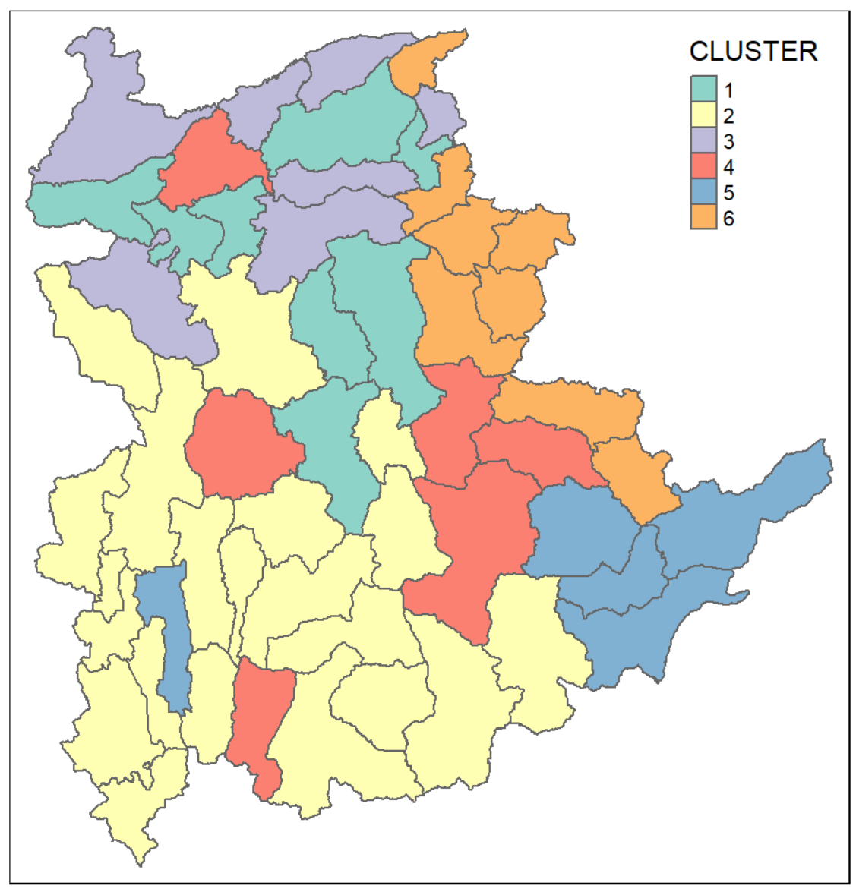
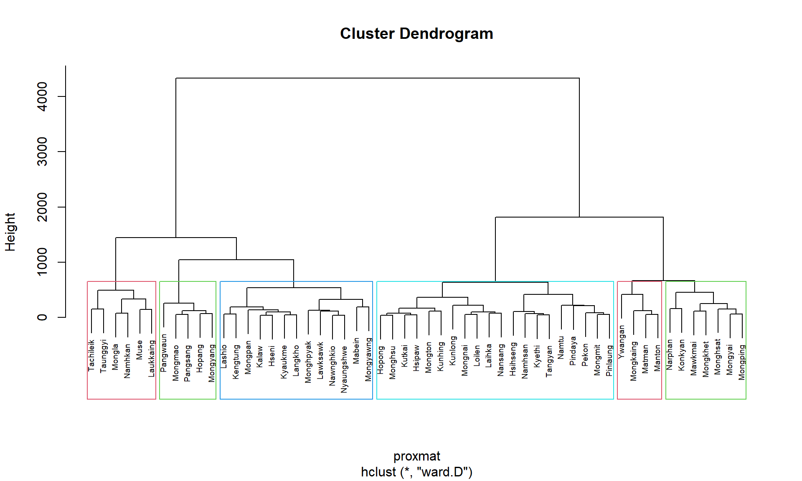
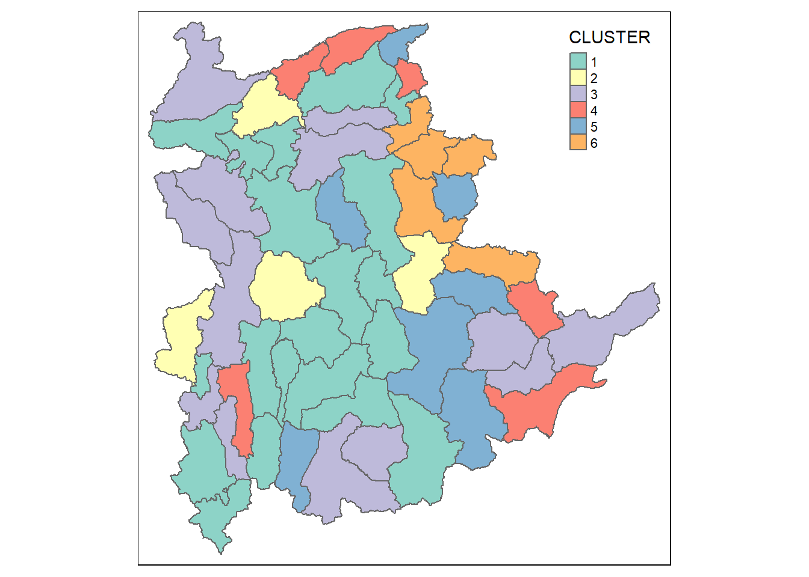
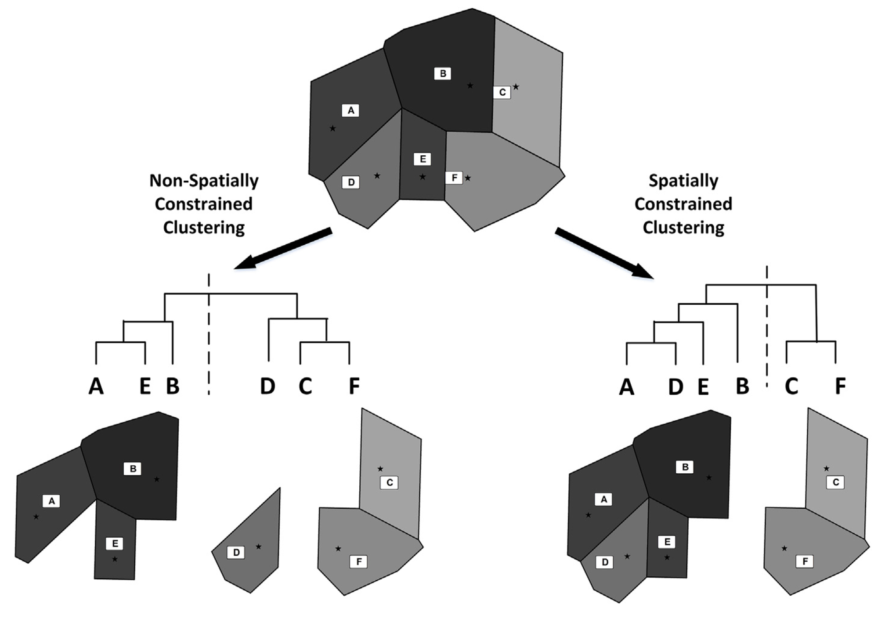
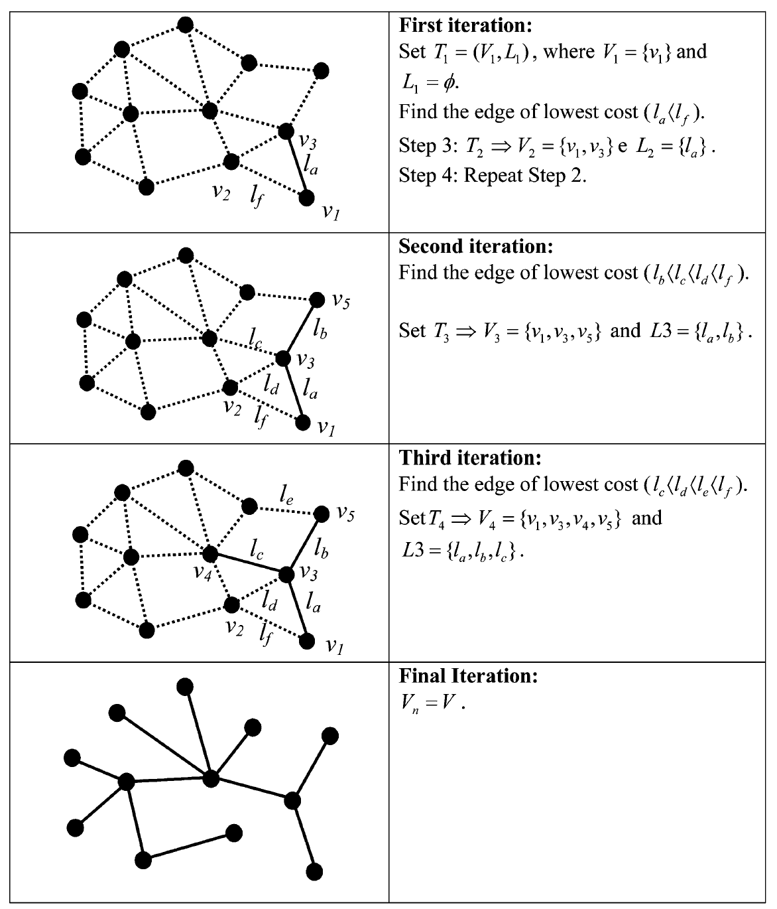
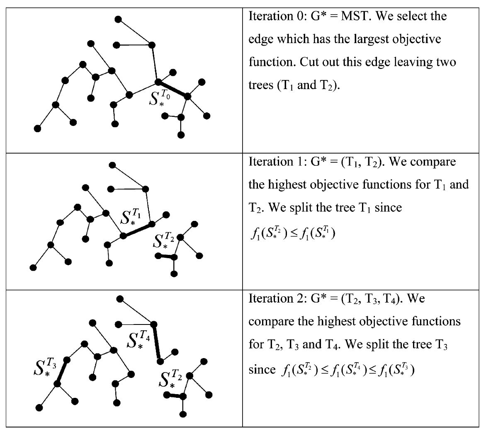
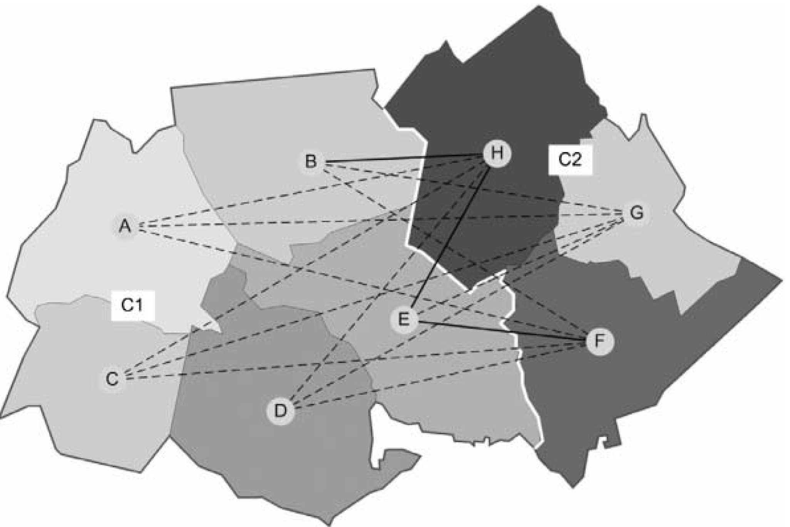
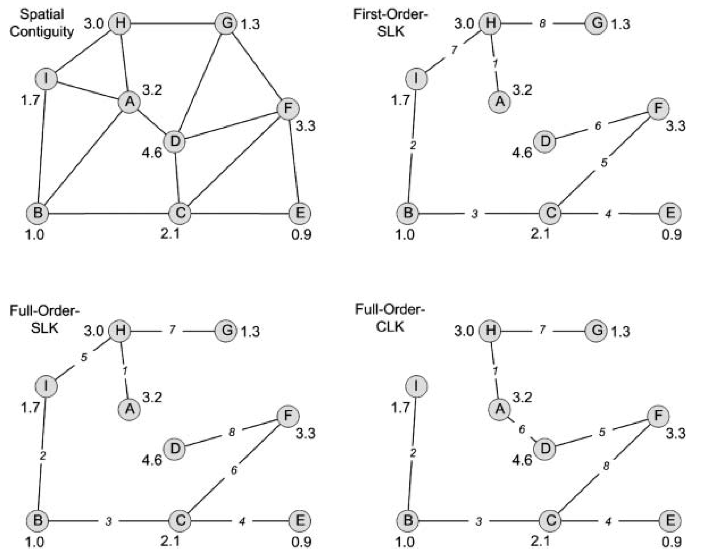
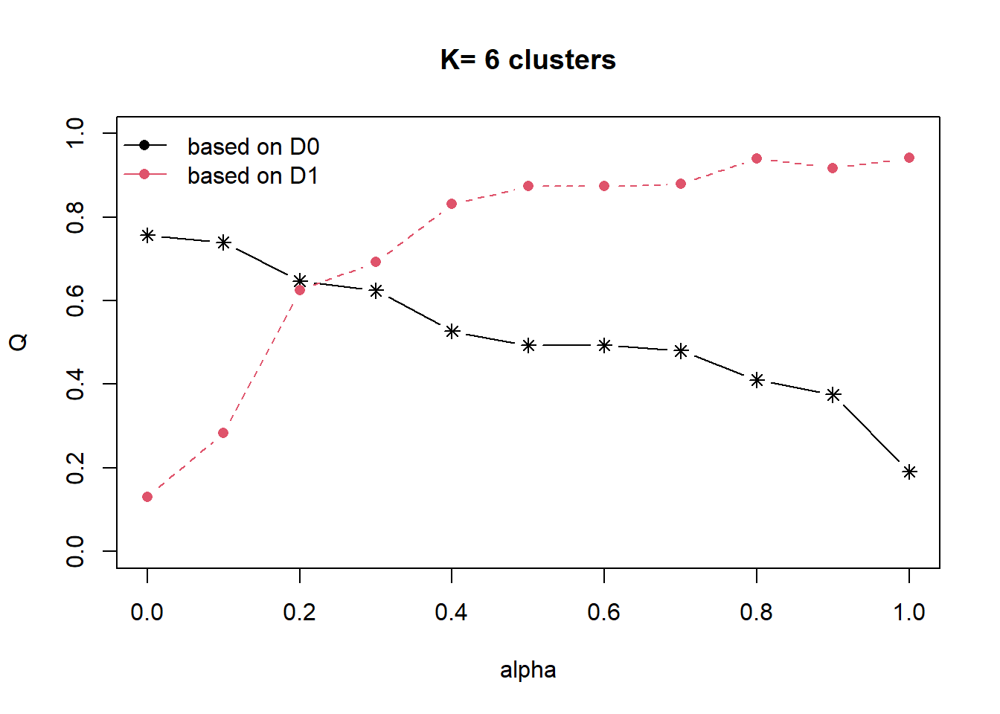
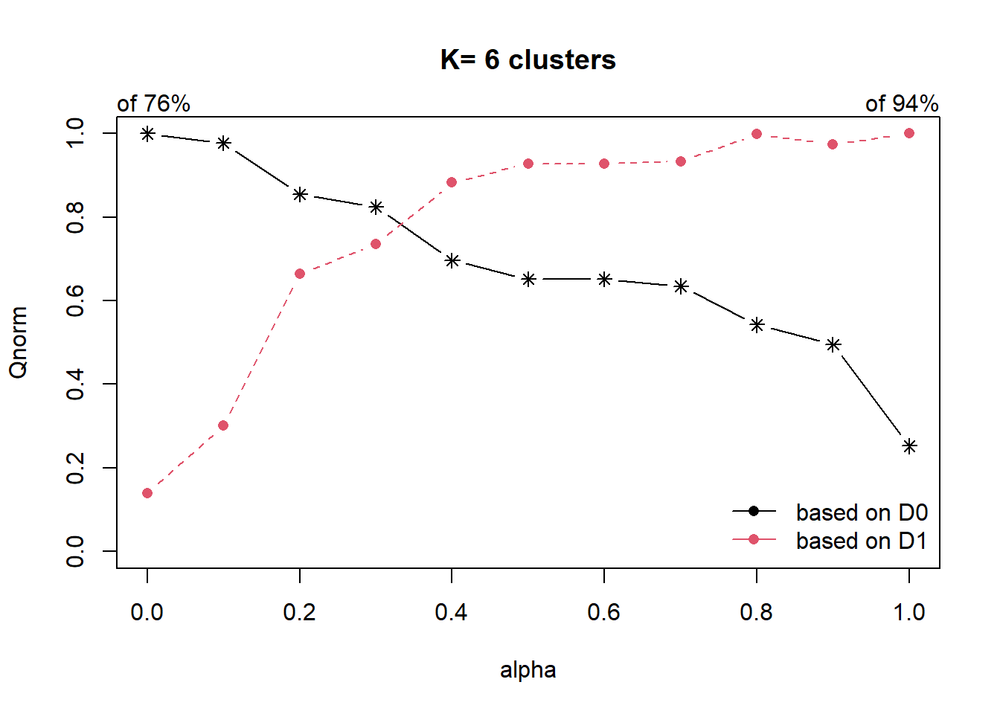

## Content

- Introduction to Geographic Segmentation
- Spatialising classic clustering methods
- Spatially Constrained Clustering - Hierarchical methods
  - skater
  - REDCAP
  - clustGeo
- Spatially Constrained Clustering - Partitioning methods
  - Automatic zoning procedure (AZP)
  - max-p heuristic

## Regionalisation and Clustering

::::: columns
::: {.column width="50%"}
- Regionalisation is a process of to group a large number of geographical units such as provinces, districts or counties spatial objects into a smaller number of subsets of objects also known as regions, which are internally homogeneous and occupy contiguous regions in space.
- The process taking into consideration multivariates. Figure on the right shows regions delineated by using six ICT measures, namely: Radio, Television, Land line phone, Mobile phone, Computer, and Internet at home of Shan State, Myanmar.
:::

::: {.column width="50%"}

:::
:::::

------------------------------------------------------------------------

### Conventional regionalisation approach

:::::: columns
::: {.column width="50%"}
- Conventionally, cluster analysis methods especially hierarchical clustering methods are used to accomplish the task.

:::

:::: {.column width="50%"}

::: callout-warning
One of the major limitation of this approach is that the clustering procedure failed to incorporate the neighbourhood relationship between the geographical units.
:::
::::
::::::

## Spatially Constrained Clustering versus Non-spatially Constrained Clustering

::::: columns
::: {.column width="50%"}
A comparison of conventional non-spatially constrained clustering and spatially constrained clustering. Stars represent the centroids of sampled grid cells and polygons are Thiessen polygons that contain the centroids. Grey shading contrasts between polygons stand for the Simpson dissimilarity index (βsim) between them. Non-spatially constrained clustering produces two clusters, one of which contains polygons (C, D, and E) that are spatially disjoint. In contrast, the two clusters produced by the spatially constrained clustering form two spatially contiguous regions.
:::

::: {.column width="50%"}

:::
:::::

## Spatially Constrained Clustering

- SKATER (Spatial 'K'luster Analysis by Tree Edge Removal) algorithm

- REDCAP (Regionalization with dynamically constrained agglomerative clustering and partitioning algorithm

- ClustGeo algorithm

## SKATER (Spatial 'K'luster Analysis by Tree Edge Removal) algorithm

::::: columns
::: {.column width="50%"}
The SKATER (Spatial ’K’luster Analysis by Tree Edge Removal) builds off of a connectivity graph to represent spatial relationships between neighbouring areas, where each area is represented by a node and edges represent connections between areas. Edge costs are calculated by evaluating the dissimilarity between neighbouring areas. The connectivity graph is reduced by pruning edges with higher dissimilarity until we are left with n nodes and n−1 edges. At this point any further pruning would create subgraphs and these subgraphs become cluster candidates.
:::

::: {.column width="50%"}
{width="547"}
:::
:::::

------------------------------------------------------------------------

### A heuristic for fast tree partitioning

:::::: columns
::: {.column width="50%"}

:::

:::: {.column width="50%"}
::: callout-note
For more detail discussion on how the algorithm works, please refer to Efficient Regionalization Techniques for Socio-Economic Geographical Units Using Minimum Spanning Trees (Assunçáo et al, 2006).
:::
::::
::::::

------------------------------------------------------------------------

### Limitation of SKATER method

:::::: columns
::: {.column width="50%"}
- SKATER algorithm only takes into account first order contiguity among pairs of observation. The contiguity relations are not updated to consider the newly formed clusters. As a result, observations that are part of a cluster that borders on a given geographical unit are not considered to be neighbours of that unit unless they are also first order contiguous.
:::

:::: {.column width="50%"}

::: {style="font-size: 0.65em"}
In the figure above, the eight counties are grouped to two clusters: C1{A,B, C, D, E} and C2{F, G, H} according to their attribute values (signified with greyscale tones). Among the 15 edges that connect C1 and C2, only BH, EH, and EF are first-order edges. The first-order constraining uses only the three first-order edges to determine the distance (or dissimilarity) between C1 and C2, while the full-order strategy uses all 15 edges.
:::
::::
::::::

## REDCAP algorithm

- Regionalization with dynamically constrained agglomerative clustering and partitioning, in short **REDCAP** is specially developed by D. Guo (2008) to the limitation of SKATER discussed in previous slide.
- Like SKATER, REDCAP starts from building a spanning tree with 4 different ways (single-linkage, average-linkage, ward-linkage and the complete-linkage). The single-linkage way leads to build a minimum spanning tree. Then,REDCAP provides 2 different ways (first-order and full-order constraining) to prune the tree to find clusters. The first-order approach with a minimum spanning tree is exactly the same with SKATER.

------------------------------------------------------------------------

### Six hierarchical regionalisation methods of REDCAP

- The **First-Order-SLK** (SLK= single linkage) uses the length of edge EF (which is the shortest first-order edge in terms of the attribute dissimilarity between its two nodes) as the distance between C1 and C2,

- The **Full-Order-SLK** uses the length of edge BG, which is the shortest among all 15 edges,

- The **First-Order-CLK** (CLK=complete linkage) uses BH (which is the longest first-order edge),

- The **Full-Order-CLK** uses AH (which is the longest among all edges),

- The **First-Order-ALK** (ALK=average linkage) uses the average of BH, EH, and EF (i.e. first-order edges), and

- The **Full-Order-ALK** uses the average of all 15 edges as the distance between C1 and C2.

------------------------------------------------------------------------

### Trees derived with different constrained clustering methods.

:::::: columns
:::: {.column width="50%"}
::: {style="font-size: 0.85em"}
- Top left: Graph showing the spatial contiguity relations among objects (nodes). Each edge connects two spatial neighbours. The numerical value associated with each node represents its attribute value.

- Top right: Tree derived with the First-Order-SLK method. The number on each edge indicates the order that the edge is added to the tree.

- Bottom left: Tree derived with the Full-Order-SLK method. Note that this tree is structurally the same as the First-Order-SLK tree (top-right) but its edges are added in a different order.

- Bottomright: Tree constructed by the Full-Order-CLK method. The optimal solution for two regions is {I, B, C, E} and {F, D, A, H, G}, which can be derived with the Full-Order-CLK tree (by cutting edge CF) but cannot with the First-Order- or Full-Order-SLK tree.
:::
::::

::: {.column width="50%"}

:::
::::::

## ClustGeo Package

The R package ClustGeo implements a **Ward-like hierarchical clustering** algorithm including spatial/geographical constraints.

- Two dissimilarity matrices D0 and D1 are inputted, along with a mixing parameter alpha in \[0,1\]. The dissimilarities can be non-Euclidean and the weights of the observations can be non-uniform.
- The first matrix gives the dissimilarities in the “feature space”” and the second matrix gives the dissimilarities in the “constraint space”.
- The criterion minimized at each stage is a convex combination of the homogeneity criterion calculated with D0 and the homogeneity criterion calculated with D1. The idea is to determine a value of alpha which increases the spatial contiguity without deteriorating too much the quality of the solution based on the variables of interest i.e. those of the feature space.

------------------------------------------------------------------------

### The mixing parameter α

The mixing parameter α ∈ \[0, 1\] sets the importance of D0 and D1 in the clustering process.

- When α = 0, the geographical dissimilarities are not taken into account, and
- When α = 1 it is the clustering variables distances which are not taken into account and the clusters are obtained with the geographical distances only.

------------------------------------------------------------------------

### Choice of the mixing parameter α

Figure on the left below reveals that the proportion of explained pseudo-inertia calculated with D0 (the clustering variables distances) which is equal to 0.76 when α = 0 and decreases when α increases (black solid line). On the contrary, the proportion of explained pseudoinertia calculated with D1 (the geographical distances) is equal to 0.94 when α = 1 and decreases when α decreases (dashed line). Here, the plot would appear to suggest choosing α = 0.2 which corresponds to a loss of only 11% of clustering variables homogeneity, and a 49% increase in geographical homogeneity.

::::: columns
::: {.column width="50%"}

:::

::: {.column width="50%"}

:::
:::::
